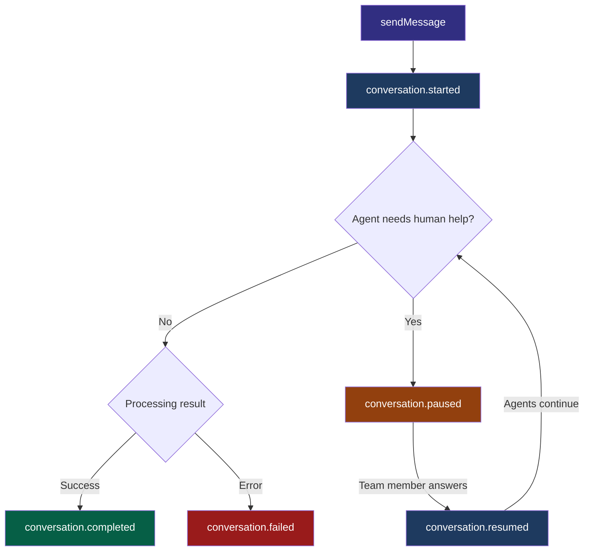

# Herald Bundle for Symfony

> **Beta** — This bundle is under active development. The API may change before the 1.0 release.

Official Symfony bundle for [Herald](https://herald-ai.net), the multi-agent orchestration engine.

## How it works

```mermaid
sequenceDiagram
    participant App as Your App
    participant Herald
    participant Team as Your Team

    App->>Herald: sendMessage("How can I help?")
    Herald-->>App: conversationId

    Note over Herald: Agents process the message asynchronously

    Herald--)App: webhook: conversation.started

    rect rgb(60, 40, 0)
        Note over Herald,Team: Human-in-the-loop (can repeat multiple times)
        Herald--)App: webhook: conversation.paused
        Herald--)Team: Notification (email / inbox)
        Team->>Herald: Answer
        Herald--)App: webhook: conversation.resumed
    end

    Herald--)App: webhook: conversation.completed + AI response
```



Herald processes messages **asynchronously**. Your app sends a message, gets a conversation ID back instantly, and then receives updates via webhooks as the AI agents work.

## Installation

Add the repository to your `composer.json`:

```json
{
    "repositories": [
        {
            "type": "vcs",
            "url": "https://github.com/AD-Conculting-AI/herald-bundle"
        }
    ]
}
```

Then install the bundle:

```bash
composer require herald-ai/herald-bundle:dev-main
```

## Configuration

Add your Herald API credentials:

```yaml
# config/packages/herald.yaml
herald:
  api_url: '%env(HERALD_API_URL)%'
  api_key: '%env(HERALD_API_KEY)%'
```

## Quick start

### 1. Send a message

Inject `HeraldClient` and call `sendMessage()`. The call returns immediately with a conversation ID.

Here is a real-world example: a customer sends an email to your support address, your app retrieves relevant customer data from your database, and forwards everything to Herald.

```php
use Herald\Bundle\Client\HeraldClient;

final readonly class SupportEmailHandler
{
    public function __construct(
        private HeraldClient $heraldClient,
        private CustomerRepository $customers,
    ) {}

    public function handle(IncomingEmail $email): string
    {
        $customer = $this->customers->findByEmail($email->from);

        $response = $this->heraldClient->sendMessage(
            endpointId: 'your-endpoint-id',
            message: $email->body,
            systemMessages: [                          // RAG context injected into the AI conversation
                "Customer: {$customer->name}",
                "Plan: {$customer->plan}",
                "Open tickets: {$customer->openTicketCount}",
                "Last order: {$customer->lastOrder->reference} ({$customer->lastOrder->status})",
            ],
            metadata: [                                // Returned as-is in webhooks
                'emailId' => $email->id,
                'customerId' => $customer->id,
            ],
        );

        // Save this ID to match with the webhook response later
        return $response->conversationId;
    }
}
```

- **systemMessages**: context from your database injected into the AI conversation. Use it to pass customer data, order history, account status — anything that helps the agents answer accurately.
- **metadata**: arbitrary key-value data attached to the conversation. Herald does not read it — it simply passes it back in every webhook, so you can correlate responses with your own records.

### 2. Receive the AI response

Herald calls your webhook endpoint as the conversation progresses. The bundle dispatches a Symfony event for each webhook call:

```php
use Herald\Bundle\Event\HeraldResponseReceivedEvent;
use Symfony\Component\EventDispatcher\Attribute\AsEventListener;

#[AsEventListener]
final readonly class SupportResponseListener
{
    public function __construct(
        private TicketRepository $tickets,
        private Mailer $mailer,
    ) {}

    public function __invoke(HeraldResponseReceivedEvent $event): void
    {
        // The AI finished processing — send the reply to the customer
        if ($event->event === 'conversation.completed') {
            $emailId = $event->metadata['emailId'];         // Your metadata, passed back as-is

            $this->mailer->reply(
                inReplyTo: $emailId,
                body: $event->response,                     // AI-generated support answer
            );
        }

        // Something went wrong — create a ticket for manual handling
        if ($event->event === 'conversation.failed') {
            $this->tickets->create(
                emailId: $event->metadata['emailId'],
                reason: $event->failureReason,
            );
        }
    }
}
```

## Webhook events reference

Herald sends 5 different events during a conversation lifecycle. You will typically only need to handle `completed` and `failed`.

### Lifecycle overview



### Events detail

#### `conversation.started`

The agents received your message and began processing. No response yet.

```php
if ($event->event === 'conversation.started') {
    // You can update your UI: "AI is thinking..."
    $conversationId = $event->conversationId;
}
```

#### `conversation.paused`

An agent escalated the conversation to a human. A team member needs to answer in the Herald inbox before processing can continue.

```php
if ($event->event === 'conversation.paused') {
    // You can notify the user: "A team member is reviewing your request"
    $conversationId = $event->conversationId;
}
```

#### `conversation.resumed`

A team member answered the escalation. The agents resumed processing.

```php
if ($event->event === 'conversation.resumed') {
    // You can update your UI: "AI is processing the answer..."
    $conversationId = $event->conversationId;
}
```

#### `conversation.completed`

The agents finished processing. The AI response and usage statistics are available.

```php
if ($event->event === 'conversation.completed') {
    $event->response;                      // "Here is how I can help..."
    $event->conversationId;                // "conv_abc123"
    $event->metadata;                      // ['userId' => 'user-123', ...]

    // Usage statistics
    $event->usage['inputTokens'];          // 1250
    $event->usage['outputTokens'];         // 340
    $event->usage['totalCost'];            // "0.0042"  (USD)
    $event->usage['primaryModel'];         // "claude-sonnet-4-20250514"
    $event->usage['llmCalls'];             // 3
    $event->usage['generationTimeMs'];     // 4200
}
```

#### `conversation.failed`

Something went wrong during processing.

```php
if ($event->event === 'conversation.failed') {
    $event->failureReason;                 // "Rate limit exceeded"
    $event->conversationId;                // "conv_abc123"
    $event->metadata;                      // ['userId' => 'user-123', ...]
}
```

### All event fields

| Field | Available in | Description |
|-------|-------------|-------------|
| `$event->event` | All events | Event name (`conversation.started`, etc.) |
| `$event->conversationId` | All events | Conversation ID (matches `sendMessage()` return) |
| `$event->nodeId` | All events | Which agent node triggered this event |
| `$event->stackId` | All events | Your agent stack ID |
| `$event->stackName` | All events | Your agent stack name |
| `$event->status` | All events | Conversation status (`pending`, `paused`, `completed`, `failed`) |
| `$event->metadata` | All events | Your metadata from `sendMessage()`, returned as-is |
| `$event->response` | `completed` | The AI-generated response |
| `$event->failureReason` | `failed` | Why processing failed |
| `$event->usage` | `completed`, `failed` | Token counts, costs, model info (see table below) |

### Usage statistics

| Field | Type | Example |
|-------|------|---------|
| `usage['inputTokens']` | `int` | `1250` |
| `usage['outputTokens']` | `int` | `340` |
| `usage['inputCost']` | `?string` | `"0.0031"` |
| `usage['outputCost']` | `?string` | `"0.0011"` |
| `usage['totalCost']` | `?string` | `"0.0042"` |
| `usage['llmCalls']` | `int` | `3` |
| `usage['primaryModel']` | `?string` | `"claude-sonnet-4-20250514"` |
| `usage['generationTimeMs']` | `int` | `4200` |

## Requirements

- PHP 8.2+
- Symfony 7.0+ or 8.0+

## License

MIT

## Links

- [Herald](https://herald-ai.net) — Multi-agent orchestration engine
- [Documentation](https://herald-ai.net/docs)
- [GitHub](https://github.com/AD-Conculting-AI/herald-bundle)
